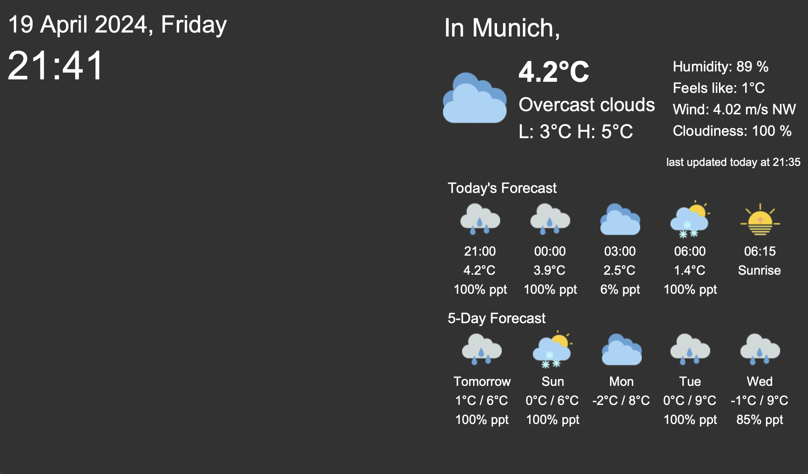

# WeatherStation

Raspberry Pi Weather Station 



Sensor (to be) used:
- SCD30 Air Quality (Temperature, Humidity, CO2 concentration)

## About This
I wanted to create a weather station that displays the atmospheric condition of my room (internal) and the weather forecast.

The interface for weather forecast is currently ready and up on GitHub. However, I am currently waiting for my sensors to be delivered and have time to tinker with them. The updated codes will be updated in due time.

Free version of [OpenWeatherMap API](https://openweathermap.org/) was used to retrieve weather information and then displayed. 

## Get the current interface

To clone the repository.
``` bash
git clone https://github.com/mrpotatomann-cs/WeatherStation
```

Copy the following command to install the necessary dependencies and requirements.
``` bash
cd WeatherStation
sh install.sh
```

Before having the interface up, please modify the code in the following file with your API key from OpenWeatherMap and your current city.
``` bash
nano config.py
```

Once completed, you may run the following code to display the interface.
``` bash
python3 main.py
```


## Note:
The installation code on this README page is meant for Raspberry Pi Raspbian OS. For other devices or OS, please modify the installation code to suit your need.

